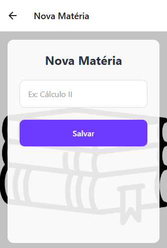
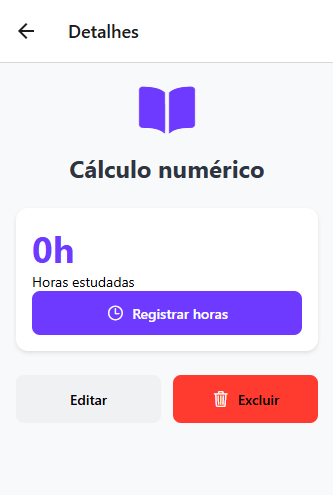

# Study-planner

# 📚 Organizador de Estudos

*Um aplicativo para gerenciar suas matérias e horas de estudo*

## 🚀 Funcionalidades
- ✅ Cadastro de matérias com horas estudadas  
- 📊 Gráficos de progresso semanal  
- 🔔 Lembretes com vibração  
- 🎨 Interface intuitiva com tema escuro/claro  
- 📱 Offline-first (AsyncStorage)  

## 📸 Screenshots
| Tela Inicial | Adicionar Matéria | Progresso |
|--------------|-------------------|-----------|
|  |  |  |

## 🧩 Estrutura do Projeto

## 🛠 Tecnologias
- React Native  
- Expo  
- React Navigation  
- React Native Chart Kit  
- AsyncStorage  

organizador-estudos/
├── assets/
│ ├── background.jpg
│ └── logo-book.png
├── components/
│ ├── BackgroundLogo.js
│ └── FloatingButton.js
├── config/
│ └── bancolocal.js
├── navegacao/
│ └── RotasApp.js
├── telas/
│ ├── app/
│ │ ├── Feed.js
│ │ ├── Postar.js
│ │ └── Excluir.js
│ └── autenticacao/
│ ├── Login.js
│ └── Cadastro.js
├── App.js
└── package.json

## ⚙️ Como Executar
1. Clone o repositório:
```bash
git clone https://github.com/seu-usuario/organizador-estudos.git

npm install

npx expo start --tunnel

📌 Requisitos

Node.js 16+

Expo CLI

Dispositivo móvel com Expo Go ou emulador

Desenvolvido por [Vinícius do Nascimento Generoso] | RA: 22.123.103-8 |[2025]
